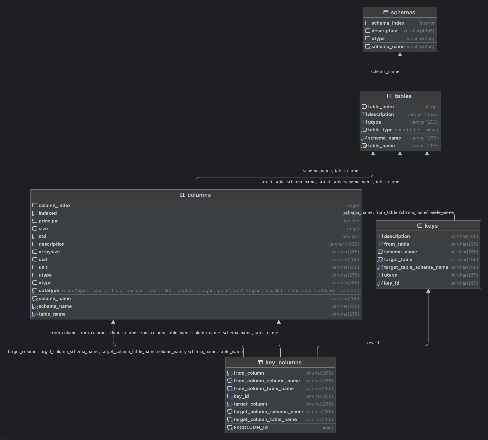

Schema
======

The schema for the model instance serializations can be found below

* [XML](generated/schema/tapschema.vo-dml.xsd){:download=tapschema.vo-dml.xsd}
* [JSON](generated/schema/tapschema.vo-dml.json){:download=tapschema.vo-dml.json}

The database schema for the TAPschema conforms with the standard

and the [tapschema instance of the tapschema](generated/schema/tapschema.vo-dml.tap.xml){:download=tapschema.vo-dml.tap.xml}